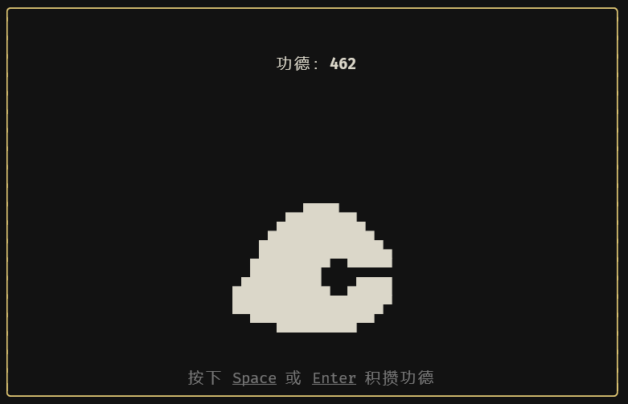

# 电子木鱼 💻️🌲🐟

[![npm version][npm-version-badge]][npm-version-href]
[![license][license-badge]][license-href]

~~功德 +1~~

基于命令行的电子木鱼。



## 安装

```bash
npm install -g wooden-fish
```

## 使用

```bash
wooden-fish
```

按下 `Space` 或 `Enter` 键，开始积攒功德。

## 功德

在电子木鱼上积攒的功德数量，将存储在：
+ `Windows`：`C:/Users/USERNAME/AppData/Roaming/wooden-fish/Config/config.json`
+ `Linux`：`~/.config/wooden-fish/config.json`
+ `macOS`：`~/Library/Preferences/wooden-fish/config.json`

~~删除缓存文件，可以重置功德。~~

## 相关

[vue-termui](https://github.com/vue-terminal/vue-termui)

<!-- Badge -->
[npm-version-badge]: https://img.shields.io/npm/v/wooden-fish?style=flat&color=ddd&labelColor=444
[npm-version-href]: https://www.npmjs.com/package/wooden-fish
[license-badge]: https://img.shields.io/github/license/Lu-Jiejie/wooden-fish?style=flat&color=ddd&labelColor=444
[license-href]: https://github.com/Lu-Jiejie/wooden-fish/blob/main/LICENSE
